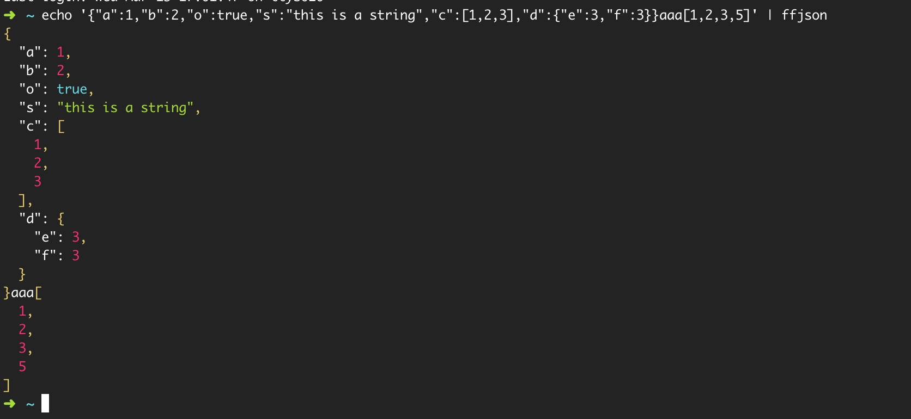

# ffjson

filter and format json in the string

## install

```
npm i ffjson -g 

```

## Usage


```
const ffjson = require('ffjson');
let str = '{"a":1,"b":2,"o":true,"s":"this is a string","c":[1,2,3],"d":{"e":3,"f":3}}aaa[1,2,3,5]'
let items = ffjson.filterFormatJSON(str);
// item : {isJson:true, content:....}

```


```
cat xxx.file | ffjson
tail -f xxx.log | ffjson
echo '{"a":1,"b":2,"o":true,"s":"this is a string","c":[1,2,3],"d":{"e":3,"f":3}}aaa[1,2,3,5]' | ffjson
```

